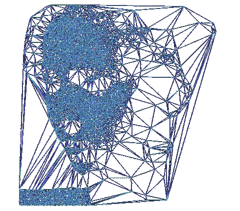
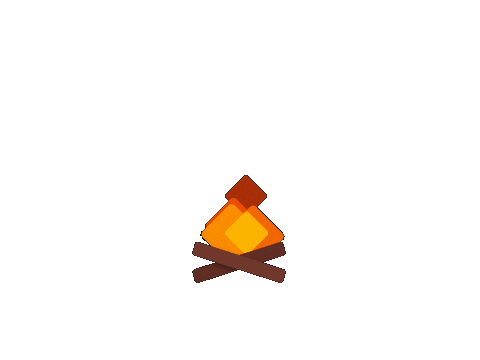

# 

[//]: # (![Header]&#40;media/ml_wide.gif&#41;)
# 
Hello, I'm You from Future

[//]: # (![Header]&#40;media/sands.gif&#41;)
# 

# 

# 

[//]: # (![Anurag's GitHub stats]&#40;https://github-readme-stats.vercel.app/api?username=EgorDS15&theme=jolly&show=reviews,discussions_started,discussions_answered,prs_merged,prs_merged_percentage&#41;)

[//]: # (![Header]&#40;media/result.gif&#41;)
